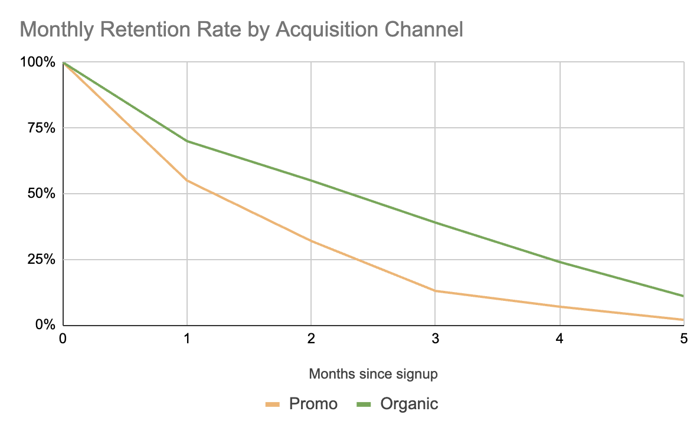
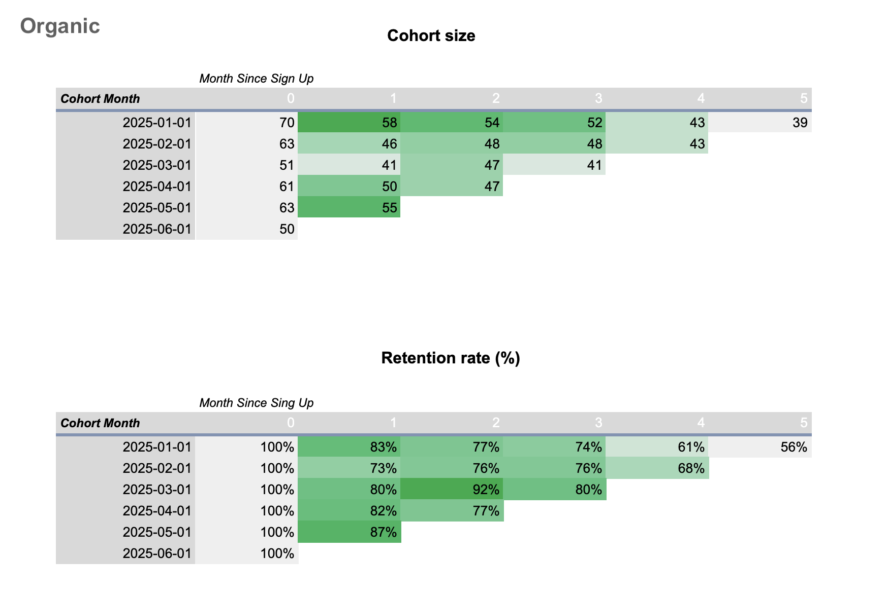
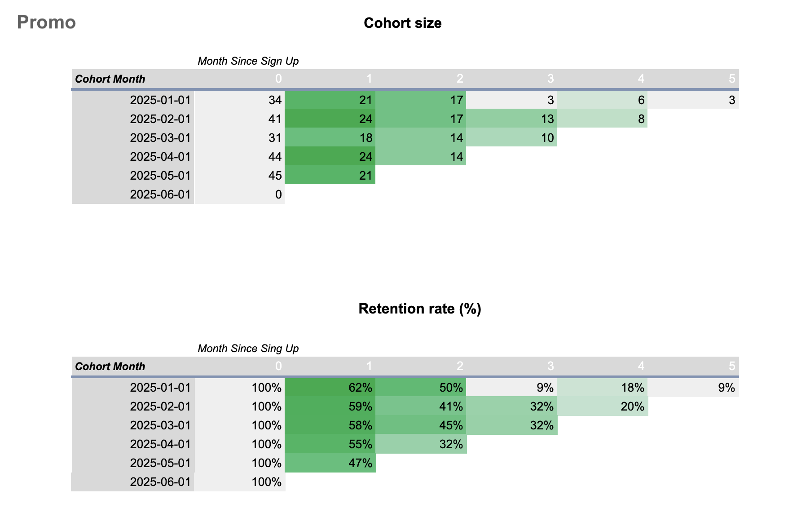

# 📊 Cohort Retention Analysis
User retention analysis using cohort methodology (SQL + Google Sheets)

## 📌 Overview

User retention is a key indicator of product health and long-term growth.  
In this project, I analyze how user engagement evolves after signup and compare retention between users acquired through **promotional campaigns** and **organic channels**.

---

## ❓ Key Questions

- How does user retention change over time?
- Do promo users retain as well as organic users?
- Are there any unusual patterns across specific cohorts?

---

## 📂 Dataset

The analysis is based on two datasets:

- **Users** — signup information (user_id, name, email, country, signup date, acquisition channel, device, etc.)
- **Events** — user activity over time (event_id, event_type, event_timestamp, revenue)

**Note:** The analysis includes cohorts from January to June 2025.

---

## ⚙️ Methodology & Data Preparation

The raw dataset required extensive cleaning and transformation before the analysis could be performed.

### 🧹 Data Cleaning
The initial data contained several quality issues that needed to be addressed:
* **Mixed date formats:** Inconsistent use of `/`, `.`, and `-` as separators.
* **Type mismatch:** Datetime values were stored as text strings.
* **Formatting noise:** Extra spaces and inconsistent day/month/year structures (e.g., `DD-MM-YY` vs `YYYY-MM-DD`).

### 🛠 SQL Transformations
To build a reliable cohort model, I implemented a multi-stage SQL pipeline:
* **Parsing & Standardization:** Used `TRIM()`, `REPLACE()`, and `REGEXP_REPLACE()` to normalize strings, followed by `TO_TIMESTAMP()` with custom masks to ensure consistent date conversion
* **Cohort Definition:** Applied `DATE_TRUNC('month', ...)` to group users based on their signup month.
* **Lifetime Calculation:** Developed logic to calculate `month_offset` (the number of months between signup and each subsequent event).
* **Aggregation:** Used `COUNT(DISTINCT user_id)` and `JOIN` operations to calculate active users per cohort and segment results by acquisition channel.

> [!IMPORTANT]
> **[View the full SQL script here](sql/cohort_analysis.sql)** — *this file contains the complete data cleaning pipeline, CTEs, and cohort calculations.*

---
## 📈 Results

### Retention by Acquisition Channel

Retention declines over time for all users, with the largest drop occurring immediately after signup.
Organic users consistently retain at higher levels, while promo users show a steeper decline in the early periods.  
As a result, the difference between the two groups becomes more noticeable over time.

Overall, the two acquisition channels demonstrate clearly different retention patterns.

### 2. Segment Analysis: Organic vs. Promo

Organic users consistently retain at higher levels, while promo users show a steeper decline in the early periods.

#### Organic Users

**Cohort Heatmap**

---

#### Promo Users

**Cohort Heatmap**

**Note:** Additional visualizations are available in the `docs/images` folder.
---

## 🚨 Notable Anomalies

Several unusual cohort patterns were identified:

- **January Promo cohort:** A sharp drop from ~50% to ~9% in Month 3, followed by a partial recovery.
- **March Organic cohort:** An unexpected increase in retention (from ~80% to ~92% in Month 2).

These patterns may indicate:

- potential data inconsistencies  
- delayed user engagement  
- campaign-specific effects  

Further investigation would be required to confirm the cause.

---

## 💡 Key Insights

- **The First Month is Critical:** The most significant churn happens right after signup.
- **Quality of Acquisition:** Organic acquisition is associated with stronger long-term engagement and more stable retention.
- **Promo Limitations:** Promo campaigns generate initial activity but suffer from higher churn rates over time.
- **Non-linear Patterns:** Retention is not always a straight decline; anomalies (like the March Organic cohort) suggest segments of highly loyal or re-engaged users.

---

## 🚀 Next Steps

- Investigate anomalous cohorts in more detail to find root causes.
- Segment retention by additional dimensions such as **device** and **country**.
- Analyze **Revenue / LTV** to evaluate the financial quality of each cohort.
- Break down promo campaigns by specific types (e.g., discount vs. free trial).

---

## 🧠 Business Interpretation

The results suggest that acquisition alone is not enough. Improving early retention (Month 1–2) will have the highest impact on overall user lifetime value. While promo campaigns boost initial numbers, long-term growth is primarily driven by the organic user base.

---

## 🛠 Tools Used

- **PostgreSQL** — data storage, cleaning, and complex querying.
- **Google Sheets** — pivot tables, cohort calculations, and data visualization.

---

## 🤓 About me

Hi there! I’m **Iryna** 👋

I’m currently transitioning into **Data Analytics** and building my skills through hands-on projects like this one. I’m especially interested in working with messy, real-world data, asking better questions, and finding meaningful insights in complex datasets.

---

## 📜 License

This project is licensed under the MIT License.
